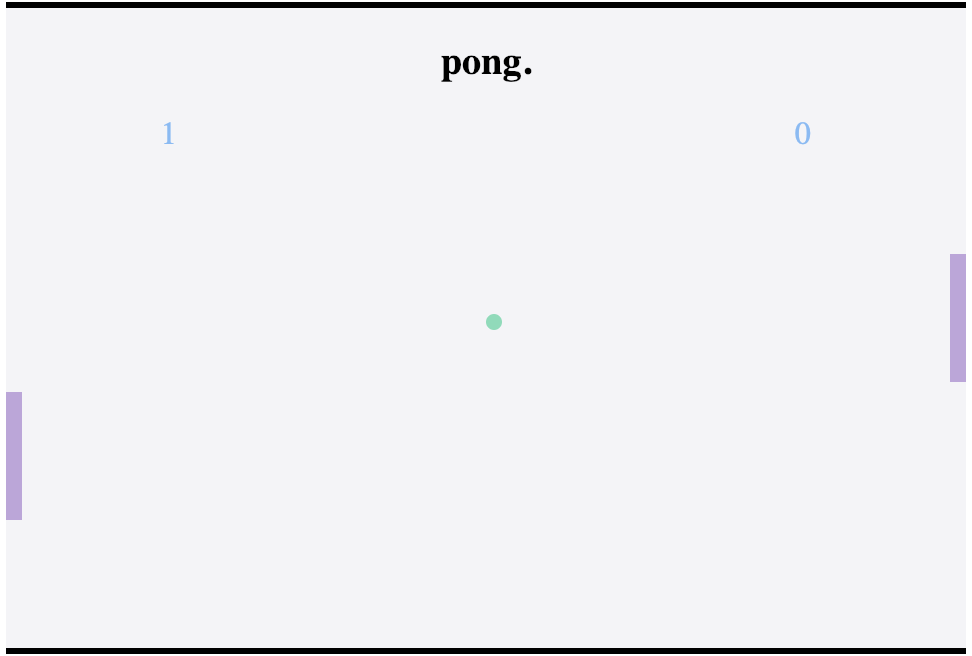

# GameProject
# WDI Project 1: Pong

My game is Pong. Pong is a table tennis sports game, and is one of the earliest arcade games commercially released.
The game was originally manufactured by Atari, which released it in 1972. Allan Alcorn created Pong as a training exercise assigned to him by Atari co-founder Nolan Bushnell. 

I originally wrote this game in canvas, but decided to give it a try using only JS, HTML and CSS. While much more difficult, I felt I learned a lot, and got a good understanding of the positioning of HTML and DOM elements.

In terms of next steps, I'd like to figure out a better random generation for initial ball position and speed, and possibly add in two more players (top and bottom of screen) which could make the game four player.

